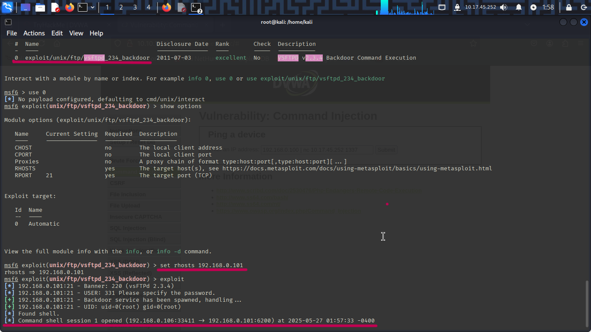

# Vulnerability Report : VSFTPD 2.3.4 - Remote Code Execution (RCE)

* Severity : Critical

* Tool Used : Nmap + Metasploit

* CVE : CVE-2011-2523

* Impact : Allow to gain full control over the target System.

* Proof of Concept (POC):  

1. Used a Metasploit Module : `unix/ftp/vsftpd_234_backdoor`  
2. Set the Rhosts int the options of the module.  
3. Type 'Exploit' and get the access of the system.

* Recommendation:  

 - Uninstall vsftpd 2.3.4 immediately and replace it with a secure, up-to-date version from your linux distribution's official repositiory.

* Attachments:  

  
