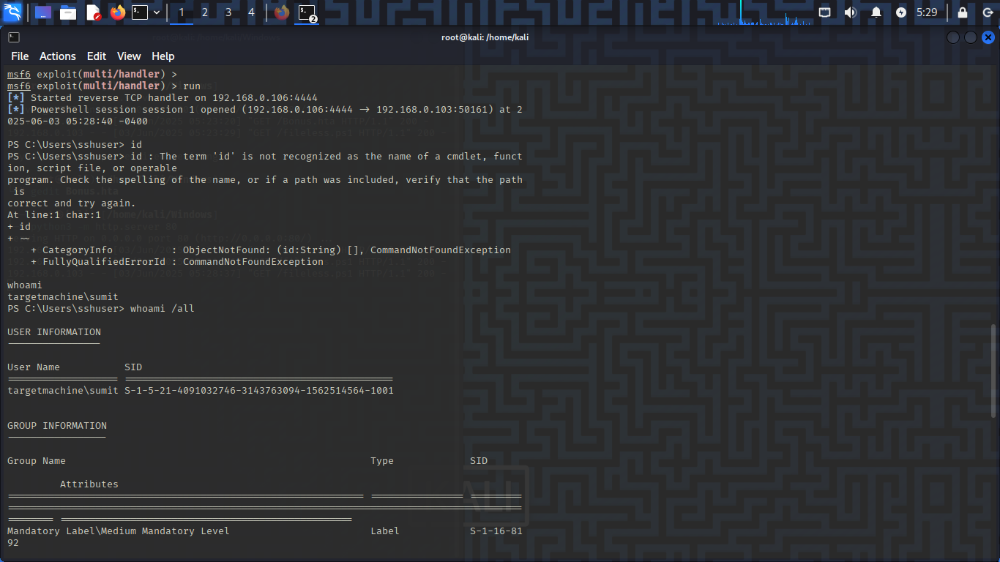

# Detection Usecase 1 : Fileless Malware with PowerShell


# Scenario Summary: 

A User is executing a file which is send to him using shared Folders. After executing the file, many outbound connection is done via the user system by the file , which made system into downloading a ps1 file and executing it silently.

# Attack Steps:

Here, Virtual Windows 11 is the victim where universal forwarder is running,  
and Virtual Kali Linux is the attacker.

- The Attack was simulated by Kali Linux on Windows as follows:  
1) Attacker Login to Victim Machine via SMB and upload a hta file into the users system. - [see the hta file here](Bonus.hta)  
```
smbclient //192.168.0.103/Secret -U sshuser
put Bonus.hta
```
2) The User out of curosity execute the program and as a result the executable download a ps1 and run it silently which gave remote access of the system to the attacker.  


*******************************

- Tools Used:  
    - Attacking Tool : Fileless Malware (made as a Pwsh Script), Metasploit 
    - SIEM : Splunk Free  
    - Log Source : Windows Security Event Logs, Sysmon


# Event ID / Data Source Mapping:

| Source                    | EventCode | Description                      |
|---------------------------|-----------|----------------------------------|
| WinEventLog : Sysmon      | 1         | Process Creation                 |
| WinEventLog : Sysmon      | 3         | Network Connection Detected      |

# Detection Query / Logic:
```spl 
- Search - PowerShell
index=* EventCode=1 PowerShell.EXE
```
```spl 
- Search - Command Execution using Powershell
index=* EventCode=1 CommandLIne="powershell.exe*" OR ParentImage="*powershell.exe"
```

# Sample Alert Screenshot

1) User has executed the file.  


2) Executed file downloaded and executed a ps1 file.


3) Immediately after ps1 file is executed a network connection is been detected which indicate a remote connection is established.  


4) After that 'whoami' command is executed that indicate remote connection is established and attacker is checking group info.    


*********************

# Analyst Notes / Recommendations:

1) What Should an Analyst do ? 

-> Confirm the Detection - Verify logs and see the indicators(e.g., Cmd-Line,ParentCmdLine,Process Relationships etc).  
-> Contain the Threat - Isolate the system and stop any malicious runinng processes and disable the user account involved in the attack.  
-> Check for any lateral Movement in the system - Delete any downloaded files, check for scheduled tasks or any persistence mechanism.  
-> Collect the Evidence & Restore the System.  
-> Report & Document the incident & Improve.


# Detection Status

 -> Successfully Detected.  
